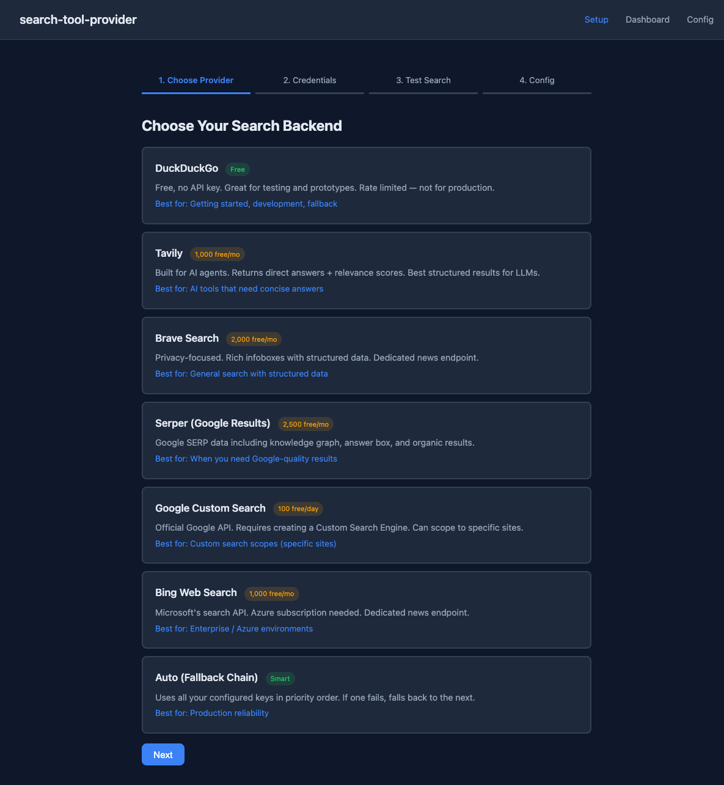
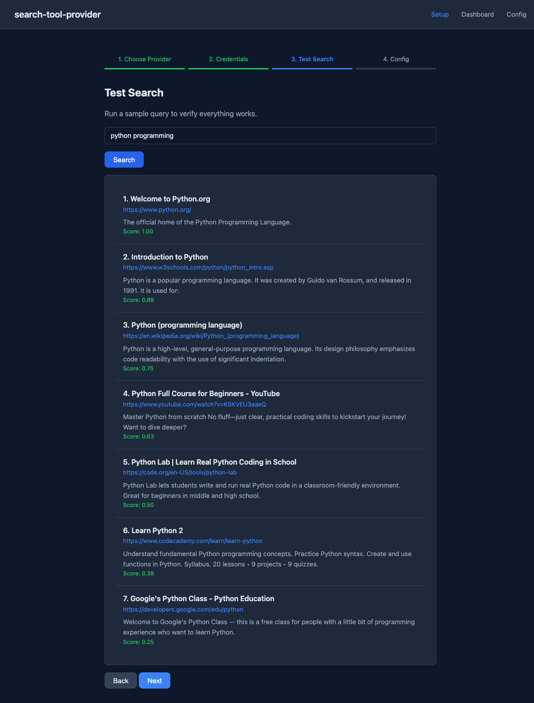
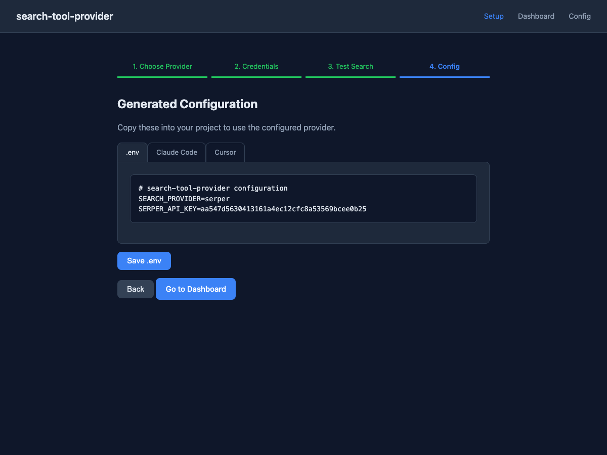
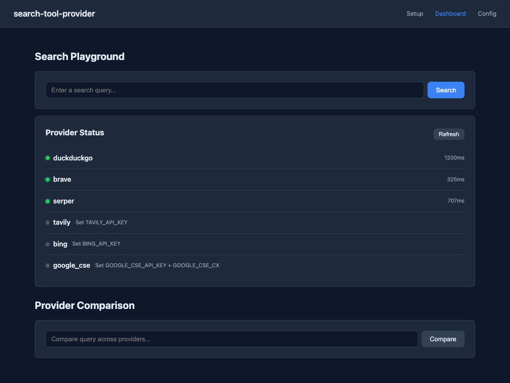

# search-tool-provider

Unified async web search across 6+ backends. One interface, swap providers freely.

```python
from search_tool_provider import get_provider

provider = get_provider("duckduckgo")
response = await provider.search("python asyncio tutorial")

for result in response.results:
    print(f"{result.title} ({result.score:.2f})")
    print(f"  {result.url}")
```

## 30-Second Quick Start

No API key needed — DuckDuckGo works out of the box:

```bash
pip install search-tool-provider[duckduckgo,cli]
search-provider-cli
```

```
> python web frameworks
┌─ Results (5) ────────────────────────────────────┐
│ 1. Django   https://djangoproject.com   0.83     │
│ 2. Flask    https://flask.palletsprojects.com ... │
└──────────────────────────────────────────────────┘
```

## 5-Minute Setup

**Option A — Admin wizard** (visual, teaches as it guides):

```bash
pip install search-tool-provider[admin,duckduckgo]
search-provider-admin
# Open http://localhost:8200
```

The 4-step wizard walks you through everything:

1. **Choose provider** — pick from 7 backends with pricing and use-case guidance
2. **Enter credentials** — paste your API key (with direct signup links)
3. **Test search** — run a live query to verify it works
4. **Save config** — click **Save .env** to persist your keys (safe merge — never overwrites existing keys)





**Option B — Manual `.env`**:

```bash
cp .env.example .env
# Edit .env — fill in your provider and API key
```

**Option C — CLI** (fast, terminal-based):

```bash
pip install search-tool-provider[cli,duckduckgo]
export TAVILY_API_KEY="tvly-..."          # optional — any provider key
search-provider-cli
> /info                                    # see what's configured
> /provider tavily                         # switch providers
> /compare python web frameworks           # compare across all providers
```

## Recipes

### Basic search

```python
from search_tool_provider import get_provider

provider = get_provider("tavily", api_key="tvly-...")
response = await provider.search("latest python features", max_results=5)

for r in response.results:
    print(f"{r.title}: {r.url} (score: {r.score:.2f})")
```

### News search

```python
provider = get_provider("brave", api_key="BSA...")
news = await provider.search_news("AI regulation", max_results=5)
```

### Direct answers

```python
provider = get_provider("tavily", api_key="tvly-...")
answer = await provider.get_answer("What is the capital of France?")
# → "Paris is the capital of France."
```

### Fallback chain

```python
from search_tool_provider import get_provider

# Auto-detects available API keys, tries in priority order
provider = get_provider("fallback")
response = await provider.search("query")
# Tries: serper → tavily → brave → bing → duckduckgo
```

Or build from environment variables:

```python
from search_tool_provider.providers.fallback import FallbackProvider

provider = FallbackProvider.from_env()  # reads all *_API_KEY env vars
```

### Error handling

```python
from search_tool_provider import get_provider, RateLimitError, SearchTimeoutError

provider = get_provider("tavily", api_key="tvly-...")
try:
    response = await provider.search("query")
except RateLimitError as e:
    print(f"Rate limited. Retry after: {e.retry_after}s")
except SearchTimeoutError:
    print("Provider timed out")
```

### Caching

```python
from search_tool_provider.providers.fallback import FallbackProvider

# Cache results for 5 minutes — avoids burning quota during development
provider = FallbackProvider.from_env(cache_ttl=300)
```

### Custom provider

```python
from search_tool_provider import SearchProvider, SearchResponse, SearchResult, register_provider

class MySearchProvider(SearchProvider):
    async def search(self, query, max_results=10, **kwargs):
        # Your search logic here
        return SearchResponse(
            results=[SearchResult(title="Example", url="https://example.com")],
            query=query,
            provider="my_search",
        )

register_provider("my_search", MySearchProvider)
provider = get_provider("my_search")
```

## API Reference

### SearchProvider (ABC)

| Method | Required | Description |
|--------|----------|-------------|
| `search(query, max_results=10, **kwargs)` | Yes | Web search → `SearchResponse` |
| `search_news(query, max_results=5)` | No | News search (defaults to regular search) |
| `get_answer(query)` | No | Direct answer → `str \| None` |
| `get_provider_info()` | No | Provider status → `ProviderInfo` |

### Models

**SearchResult** — a single result:
- `title`, `url`, `snippet` — the basics
- `score` — relevance (0.0–1.0, normalized)
- `source` — which provider returned it
- `published_date` — publication date (if available)
- `raw` — provider-specific raw data

**SearchResponse** — container for results:
- `results` — list of `SearchResult`
- `query`, `provider` — what was searched and who answered
- `answer` — direct answer string (Tavily, Serper)
- `knowledge_graph` — structured data (Serper, Brave infobox)

**SearchQuery** — query with validation:
- `query` — search string (required, non-empty)
- `max_results` — 1–50 (default 10)
- `search_type` — `WEB`, `NEWS`, `IMAGES`
- `language`, `region`, `time_range`, `safe_search`

**ProviderInfo** — status:
- `name`, `configured`, `api_key_set`, `features`, `rate_limit_remaining`

### Exceptions

```
SearchProviderError (base — catch-all)
├── AuthenticationError       — bad/missing API key
├── RateLimitError            — quota exceeded (.retry_after seconds)
├── SearchTimeoutError        — provider didn't respond
└── ProviderUnavailableError  — backend is down
```

## Backend Setup

| Provider | Free Tier | API Key Env Var | Get Key |
|----------|-----------|-----------------|---------|
| DuckDuckGo | Unlimited (rate limited) | None needed | — |
| Tavily | 1,000/month | `TAVILY_API_KEY` | [tavily.com](https://tavily.com) |
| Brave | 2,000/month | `BRAVE_API_KEY` | [brave.com/search/api](https://brave.com/search/api/) |
| Serper | 2,500/month | `SERPER_API_KEY` | [serper.dev](https://serper.dev) |
| Google CSE | 100/day | `GOOGLE_CSE_API_KEY` + `GOOGLE_CSE_CX` | [Cloud Console](https://console.cloud.google.com) |
| Bing | 1,000/month | `BING_API_KEY` | [Azure Portal](https://portal.azure.com) |

**Provider strengths:**
- **Tavily** — best for AI agents (returns direct answers + relevance scores)
- **Serper** — Google-quality results with knowledge graph and answer box
- **Brave** — privacy-focused, rich infoboxes with structured facts
- **Bing** — enterprise/Azure environments, dedicated news endpoint
- **Google CSE** — custom search scopes (restrict to specific sites)
- **DuckDuckGo** — free fallback, no key needed, great for development

## For AI Agents (MCP Server)

```bash
pip install search-tool-provider[mcp,duckduckgo]
```

**Claude Code** — add to `~/.claude/settings.json`:

```json
{
  "mcpServers": {
    "search-tool-provider": {
      "command": "search-provider-mcp",
      "env": {
        "SEARCH_PROVIDER": "duckduckgo"
      }
    }
  }
}
```

**Cursor** — add to `.cursor/mcp.json`:

```json
{
  "mcpServers": {
    "search-tool-provider": {
      "command": "search-provider-mcp",
      "env": {
        "SEARCH_PROVIDER": "tavily",
        "TAVILY_API_KEY": "tvly-..."
      }
    }
  }
}
```

**MCP tools exposed:**

| Tool | Description |
|------|-------------|
| `search(query, max_results)` | Web search |
| `search_news(query, max_results)` | News search |
| `get_answer(query)` | Direct answer |
| `get_provider_info()` | Provider status |

## CLI Tool

```bash
pip install search-tool-provider[cli,duckduckgo]
search-provider-cli
```

| Command | Description |
|---------|-------------|
| `<query>` | Search with current provider |
| `/provider [name]` | Show or switch provider |
| `/compare <query>` | Compare across all configured providers |
| `/answer <query>` | Get direct answer |
| `/info` | Show provider status and quota |
| `/export` | Show .env config |
| `/help` | Show commands |
| `/quit` | Exit |

## Admin Dashboard

```bash
pip install search-tool-provider[admin,duckduckgo]
search-provider-admin
# http://localhost:8200
```

Features:
- **Setup wizard** — 4-step guided setup with inline education about each provider
- **Save .env** — one-click config persistence with safe merge (preserves existing keys)
- **Search playground** — test queries, see results with scores
- **Provider health** — live status of all providers with latency
- **Provider comparison** — same query across all configured providers side-by-side
- **Config generator** — .env, Claude Code, and Cursor config snippets



Set port: `SEARCH_PROVIDER_ADMIN_PORT=9000 search-provider-admin`

The server auto-loads `.env` on startup, kills stale processes on the same port, and logs which API keys were detected.

## Architecture

```
src/search_tool_provider/
  __init__.py               Public API + __version__
  provider.py               SearchProvider ABC (1 abstract + 3 optional methods)
  models.py                 SearchResult, SearchResponse, SearchQuery, ProviderInfo
  exceptions.py             SearchProviderError hierarchy
  registry.py               get_provider() with lazy imports
  utils.py                  Score normalization, dedup, HTML cleaning, TTL cache
  providers/
    duckduckgo.py           Free, no API key (duckduckgo-search library)
    tavily.py               Tavily API — direct answers + relevance scores
    brave.py                Brave Search — infoboxes + news endpoint
    serper.py               Google SERP — knowledge graph + answer box
    google_cse.py           Google Custom Search Engine
    bing.py                 Bing Web Search (Azure)
    fallback.py             Multi-provider with automatic failover + caching
  mcp/
    server.py               FastMCP server (4 tools)
    config.py               Env var → provider factory
  cli/
    app.py                  Interactive CLI (rich)
  admin/
    app.py                  FastAPI admin + teaching wizard
    env_writer.py           Safe .env merge logic
    templates/              Jinja2 templates
    static/                 CSS
```

**Design decisions:**
- `httpx` is the only core dependency — most backends are plain HTTP APIs
- Optional dependency groups — install only what you need
- Async-first — all provider methods are async
- Score normalization — all providers normalize to 0.0–1.0
- Position-based fallback — when providers don't return scores, uses `1.0 - (position / (n + 1))`
- Lazy imports — providers only loaded when requested

## Optional Dependencies

```toml
[duckduckgo]  = ["duckduckgo-search>=6.0"]
[google]      = ["google-api-python-client>=2.100"]
[mcp]         = ["mcp[cli]>=1.0"]
[admin]       = ["fastapi", "uvicorn", "jinja2", "python-multipart", "python-dotenv"]
[cli]         = ["rich>=13.0"]
[all]         = everything above
```

Tavily, Brave, Serper, and Bing use only `httpx` (core dep) — no extra install needed.

## Tests

```bash
pip install search-tool-provider[all]
pip install pytest pytest-asyncio
python -m pytest tests/ -v
```

All tests are mocked — no API keys needed to run the test suite.

## License

MIT
